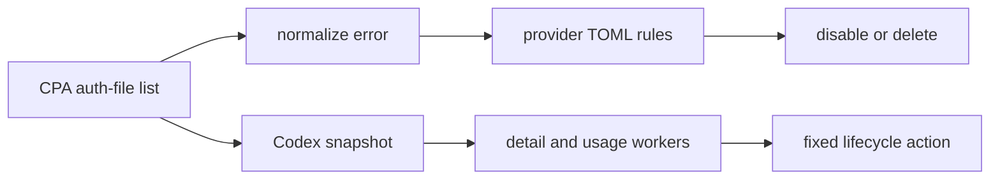

# 运行架构

系统分为全局快扫和 provider 巡检两条路径。

## 全局快扫

`FastScanService` 每轮调用一次 CPA 列表接口。它根据每行的 `type` 找到 TOML 中同名 provider，收集最小元数据，并只将 `status = "error"` 的行交给规则匹配器。

错误内容先归一化。规则无需了解上游 JSON 是嵌套结构、扁平结构还是使用 `error` 字段保存文本。匹配器只读取 `error.type`、`error.code` 和 `error.message`。

规则按优先级降序处理；优先级相同保留 TOML 声明顺序。每个记录至多执行一个快扫动作。成功的动作会标记为已处理，避免同一快照被 Codex 巡检再次写入。

## Codex 巡检

快扫完成后会原子发布快照。Codex 巡检在开始时捕获当前快照，随后在快照锁之外运行；新的快扫可以按周期继续发布下一份快照。巡检并行下载详情和检查 usage，随后按输入顺序串行执行 CPA 写入。

每个快照还携带 auth-file 的快扫版本。每次快扫写入尝试都会在释放该资源锁前推进该文件的版本；巡检在提交生命周期写入前检查相同版本，并在同一资源锁内执行写入。版本读取使用短状态锁，资源锁只覆盖同名写入。版本变化的巡检动作记录为 `fast_scan_superseded` 并跳过。不同 auth-file 不共享写锁。

生命周期行为固定在 Codex 实现中：HTTP 401/402、无刷新材料的过期或额度耗尽、额度状态协调，以及已禁用凭据的临期刷新。`providers.codex.inspection` 仅配置运行参数，不配置这些决策规则。

## 日志边界

日志包含 event、provider、rule 或 policy 标识、动作、结果、错误代码和资源哈希。认证文件名、token、认证文件正文和上游错误原文不会进入日志。
